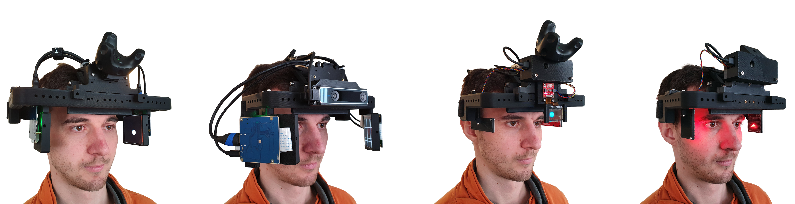
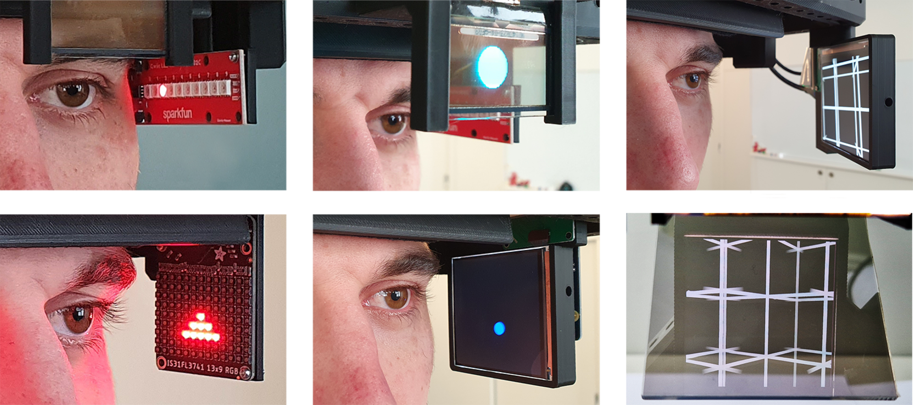

# MoPeDT - **Mo**dular **Pe**ripheral **D**isplay **T**oolkit

We introduce MoPeDT: Modular Peripheral Display Toolkit, a freely available, flexible,
reconfigurable, and extendable headset to conduct peripheral vision research. MoPeDT can be built with a 3D printer and off-the-shelf
components. It features multiple spatially configurable near-eye display modules and full 3D tracking inside and outside the lab.
With our system, researchers and designers can easily develop and prototype novel peripheral vision interaction and visualization
techniques

Preprint: https://arxiv.org/abs/2301.11007 
Video: https://youtu.be/-QJnat3sjnk

> **Explore the model [interactively](https://a360.co/3YXVchr)!** 
> Only shows one possible configuration with a few modules. Download the full CAD file to explore all available components.

## Bill of materials (BOM)

See [BOM.md](BOM.md)

## Assembly and setup

See [AssemblyAndSetup.md](AssemblyAndSetup.md)

